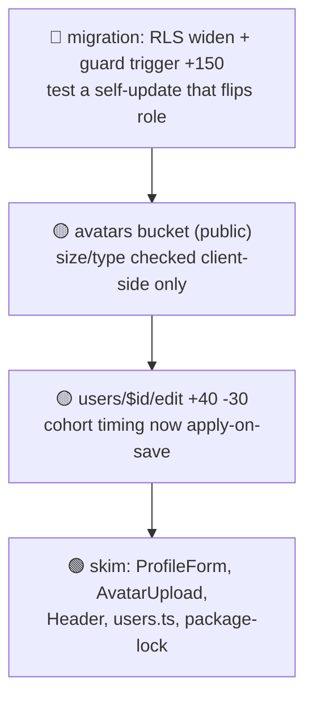

# PR Recap

Produce these artifacts for a pull request (or a branch vs. its base):

1. **Text recap** — descriptive but concise; what changed and why it matters.
2. **Risk assessment** — where a human reviewer should spend (and save) their time.
3. **Reviewer roadmap** — a single Mermaid diagram that renders the risk assessment as a
   top-to-bottom review path. Always produced.
4. **Behavioral diagram** — *only when* one change-shape dominates the PR (a flow, a
   sequence, a state machine, a schema change): a second diagram that illustrates that
   behavior. Skipped otherwise — most PRs get the roadmap alone.

GitHub renders Mermaid natively in PR comments, so the same output works locally and in
CI. This skill is deliberately model-agnostic: a script gathers the facts, and the agent
writes the prose and diagrams. Any LLM/agent can run it.

## Steps

### 1. Gather the context pack

Run the collector from the repo root. It prints a self-contained Markdown document
to stdout — no LLM calls, just `git` (plus `gh`/`jq` if present):

```bash
.claude/skills/pr-recap/collect.sh
```

Common variations:

- Specific PR: `collect.sh --pr 19`
- Explicit base: `collect.sh --base main`
- Big PRs (skip raw diff, keep stats + commits): `collect.sh --no-diff`
- Larger diff window: `collect.sh --max-diff-lines 4000`

If the diff is truncated, the numstat still lists **every** changed file. Pull any
truncated file in full with `git diff <range> -- <path>` (the range is printed at the
bottom of the pack). Never describe a file you haven't actually seen the change for.

### 2. Write the text recap

Read the context pack and write a recap with this shape. Keep it tight — a reviewer
should grasp the PR in under a minute.

- **One-line summary** — the change in a single sentence.
- **What changed** — 3–7 bullets grouped by area (feature / UI / data / infra / tests).
  Lead each bullet with the concrete change, not the file name.
- **Why it matters / impact** — user-facing effect, risk, or behavior change. Call out
  anything reviewers should scrutinize (auth, migrations, deletes, config).
- **Notes** — follow-ups, TODOs, or intentional omissions, if any.

Rules: describe only what the diff shows. Use the author's PR description (if present in
the pack) as an intent signal, not as text to copy. Prefer plain language over jargon.

### 3. Write the risk assessment

The goal is to direct reviewer attention: where to look hard, and what can be skimmed.
Rate each notable area **🔴 High / 🟡 Medium / 🟢 Low** review priority and say *why* in
one line. Order the section high → low so the riskiest items are read first.

Treat these as **higher** priority (scrutinize):

- Auth / authz / session / login flows, secrets, env, and config.
- Database migrations, schema/RLS changes, and destructive ops (drop, delete, truncate,
  bulk update). Flag anything irreversible.
- Money, permissions/roles, data retention, or anything user-data-facing.
- Complex or subtle logic: concurrency, error handling, retries, state machines, math.
- Public API / shared-component signature changes with many call sites (blast radius).
- Files with an unusually large diff, or a change touching many modules at once.
- New dependencies (supply-chain surface) and anything with no test coverage.

Treat these as **lower** priority (safe to skim):

- Generated files, lockfiles, vendored assets, pure formatting/whitespace.
- Static assets (images, SVGs), copy/text-only tweaks, comment changes.
- Mechanical renames and pure import reordering.

Format as a short bulleted list, e.g.:

- 🔴 **`admin_/login.tsx` — invisible Google overlay:** auth path; confirm the hidden
  control still fires and the click target aligns. Highest-value place to test.
- 🟢 **`public/login/*.svg`, `hero.jpg`:** new static assets, visual-only — skim.

End with a one-line **"Start here"** pointer naming the single file/change most worth a
careful look. If the PR is genuinely low-risk overall, say so plainly rather than
manufacturing concern. Base every call on the diff, not speculation.

### 4. Generate the reviewer roadmap (always)

The roadmap **is the risk assessment, rendered** — a single `flowchart TD` chain that a
reviewer reads top-to-bottom to know where to spend time. It doesn't add new facts; it
makes the triage glanceable. Build it directly from step 3.

Rules:

- **One node per 🔴 and 🟡 area**, in the *same order as the text bullets* (highest
  priority first). The top node is therefore the de-facto "start here" — do **not** also
  write a separate "Start here:" line.
- **Collapse every 🟢 item into a single terminal green node** that lists the files
  (e.g. `🟢 skim: ProfileForm, AvatarUpload, Header, users.ts`). Never one node per
  low-risk file.
- **Hard cap ~6 nodes.** If there are more than ~5 notable (🔴/🟡) areas, merge the
  closely-related ones rather than growing the chain.
- **Node label = two lines** via `<br/>`:
  - Line 1: `emoji + area/file + Δlines` — the Δlines is the summed added/deleted from
    the numstat for that area (e.g. `+150`, `+40 -30`). Use a plain `-` for deletions.
  - Line 2: a **≤6-word** what-to-check (the action, not the explanation — the "why"
    lives in the text bullets above).
- **Emoji only for color** — 🔴/🟡/🟢 in the label. Do **not** use `classDef`/`style`
  fills: they render unpredictably across GitHub's light and dark themes, and the emoji
  already carries the signal.
- **Linear chain**, one edge between consecutive nodes (`a --> b --> c --> d`). The green
  node is always last.
- End with a **one-line caption** under the diagram (e.g. *"Read top-to-bottom; 🔴 first."*).

Validate that node ids are unique and every edge references a declared node — a malformed
diagram renders as a raw error box on GitHub. Keep labels free of unescaped `"` inside
the `["..."]`.

Roadmap skeleton:


*Read top-to-bottom; 🔴 first.*

### 4b. Generate a behavioral diagram — only when one change-shape dominates

Most PRs stop at the roadmap. Add a **second** diagram *only* when a single shape below
clearly captures the PR's core behavior; if nothing dominates, skip this — do **not**
fall back to a generic "boxes-and-arrows" import map (that was the old change-map, and it
mostly just restated the text).

| If the PR's core is… | Use | Notes |
|---|---|---|
| A user/request/permission flow (auth, login, signup, routing, access gate) | `flowchart` | Show the path through the changed decision points; mark the branches. |
| Interaction between services/components over time | `sequenceDiagram` | Actors = the participants touched by the diff. |
| Status / state transitions | `stateDiagram-v2` | Only the states the PR adds or alters. |
| Schema / migration-heavy (`supabase/migrations`, SQL) | `erDiagram` | Added/changed tables & key relations. |
| Nothing clearly dominates | *(none)* | Roadmap only. |

Keep it small (≤ ~12 nodes) and output it in a fenced ```mermaid block with a one-line
caption. This diagram illustrates *the change*, so it belongs under **What changed** in
the output (see step 5), not in the risk section.

### 5. Present the result, then handle the PR comment

Output in this order:

1. **Text recap** — including the **behavioral diagram** (step 4b) under *What changed*,
   if the PR earned one.
2. **Risk assessment** — the 🔴/🟡/🟢 bullets, then the **reviewer roadmap** (step 4)
   closing the section.

So each diagram sits next to the prose it supports: the behavioral diagram illustrates
the change, and the roadmap closes the risk triage. A typical (non-dominant) PR has only
the roadmap.

Then decide what to do about posting it as a PR comment based on what the user asked for
in their original request:

- **They said to post it** (e.g. "recap this PR and comment it", "add it to the PR"):
  post it after generating, without re-asking. See the command below.
- **They said NOT to post it** (e.g. "just show me", "don't comment on the PR"):
  do not post, and do not ask.
- **They didn't say either way:** end by asking, as a follow-up step — e.g. *"Want me to
  post this as a comment on PR #<n>?"* — and act on their answer.

Posting a comment is outward-facing, so only do it when the user has asked for it or
confirmed. Post the full recap (text + risk + the ```mermaid roadmap, plus the behavioral
diagram if any); GitHub renders the Mermaid inline. Prefer a **sticky** comment so
re-running updates in place instead of piling up:

```bash
# Requires `gh`. Write the recap to a file first, then:
gh pr comment <number> --edit-last --create-if-none --body-file <file>
# Older gh without --edit-last: gh pr comment <number> --body-file <file>
```

If `gh` isn't available (e.g. another agent without it), print the exact command and the
recap file path so the user can post it themselves.

## Notes for portability & CI

- The collector is a plain POSIX-ish bash script with no Claude-specific dependencies,
  so Opencode / other agents can run it the same way and follow steps 2–5.
- A GitHub Action that posts recaps as a sticky comment is a documented follow-up in
  this folder's `README.md` — the script is already CI-ready (accepts `--pr`, needs
  only `git` + `gh`).
